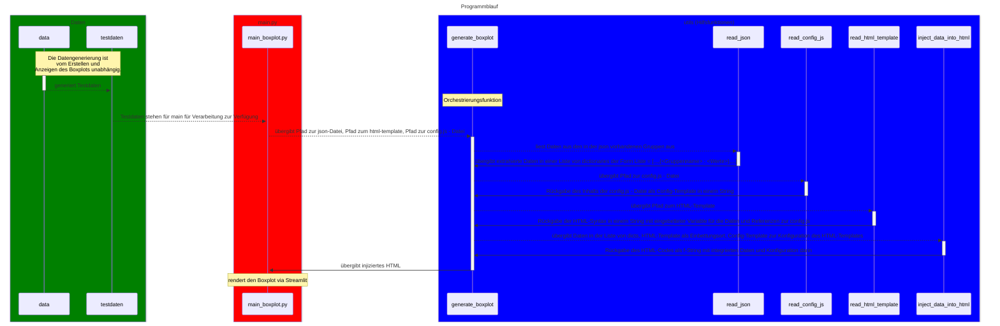

# Dokumentation des D3-Boxplot-Projektes

|             |                                                     |
|:-----------:|:---------------------------------------------------:|
| **Version** |                        0.0.1                        |
| **Status**  | funktionsfähig unter Verwendung von Testdatensätzen |
|  **Autor**  |                    Nico Seidler                     |

## Kurzbeschreibung
Das Ziel des Projektes besteht darin, 
+ *in der Testphase*: Daten selbst zu generieren
+ *später*: exportierte Daten im json-Format einzulesen
+ die eingelesenen Daten zu verarbeiten und
+ als Boxplot visuell aufzubereiten.

## Technische Umsetzung, Voraussetzungen, Installation und Ausführung
### Technische Umsetzung
Im Projekt wird die klassische `Python-Streamlit-Bibliothek` als Plattform genutzt, um den finalen Boxplot anzuzeigen.
Datenverarbeitung und Erstellung des Boxplots finden jedoch vollständig außerhalb der Python-Welt statt und werden
mittels der JavaScript-Bibliothek `D3` realisiert.
Der Aufbau des Projekts inklusive des Datenflusses kann dem verlinkten [Sequenzdiagramm](#Allgemeiner-Programmablauf-als-Sequenzdiagramm) entnommen werden.

### Installation und Ausführung
Folgende Module werden für die Lauffähigkeit der Anwendung benötigt und sind in der `requirements.txt` vermerkt:
+ `streamlit==1.58.0`
+ `Jinja2==3.1.6`
+ `pandas==3.0.3`
+ `numpy==2.4.6`

Zur *Installation* der benötigten Pakete muss der Befehl `pip install -r requirements.txt` genutzt werden.
Mit `streamlit run main_boxplot.py` wird die App automatisch gestartet und 
öffnet sich in einem entsprechenden Browserfenster.

+ *In der Testversion kann bei Bedarf auch ein neuer Satz an Testdaten mittels `python data.py` generiert werden.*

## Allgemeiner Programmablauf als Sequenzdiagramm

